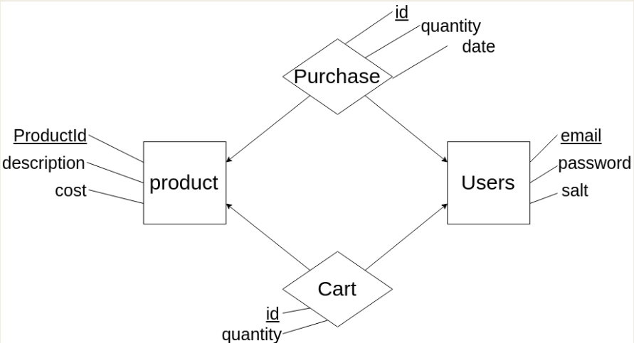

# Database Design

### EER SCHEMA

### DDL
Can be found [here](Resources/postgres.sql).

ProductId, purchase and cart id's are serial to ensure that tuple added is unique.

### Access code

Access is done using pg express module using a connection pool to access the postgres database hosted on the heroku server. A connection is made to the database every time an api function is called, and connection is released at the end of the function.
