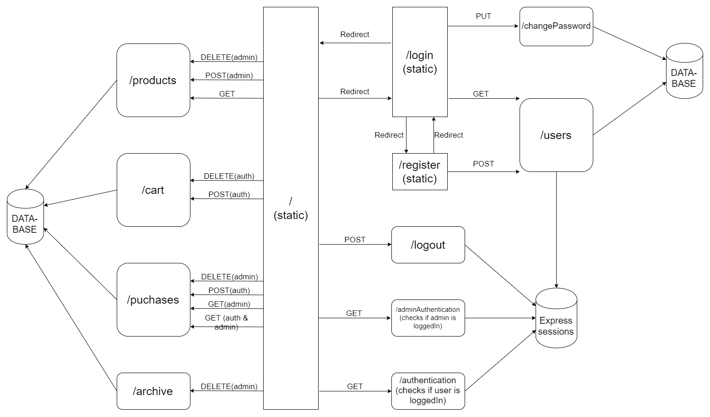

# nwen304-group-project

### How to Use the System?

1. Clone the project
2. Run 'npm install'
3. Run 'npm start'

Our project is also hosted on [heroku](https://nwen-project.herokuapp.com/)

##### How to Use the Application?

Our system has two main interfaces, One for general users of the site, and one for administrator of the site.

**Homepage** 
The application opens on a homepage, where anyone who accesses it, are able to see all the possible order items in the menu. They are able to quick search specifics, but have to start with a capital.

However, if not logged in, and users want to add an item to the cart, view the cart, or view past orders, they are prompted to log in to the application.

If already logged in, from this page, they are able to add items to their cart that they would like to buy and navigate to their cart and their past order history.

**Login** 
There is a Login button on the top right corner of the header. Click on it to jump to the login page. Here, users click type their username/email and password and click 'Login'.

If the user has not signed up before, on this web page there are also able to click a button which says 'Register'.

If the user would like to change their password, they are also able to click a button which says 'Change Password'.

If the user would like to sign in with google services, they are able to by clicking the 'Sign in with Google' link in the bottom corner.

If the user would like to return to the Homepage they are able to by clicking the 'Back' button.

**Register** 
To register as a new user, the fields will have to be filled in and password should conform to the strength rules. If the password is not considered 'strong' enough, it will be prompted on the screen.

**Change Password** 
To change the password, the user will have to fill the fields and conform to the same rules as the registration password.

**Cart** 
If logged in, the user can view their cart. In here they are able to quick search through their cart as well. They are able to remove items and purchase them.

**Order History** 
If logged in, the user is able to view details of their past orders if not archived or deleted by the admin user.

**Admin** 
The admin is able to login to the application by the following credentials:

Username: admin 
Password: Admin1

After login, they are routed to a separate homepage and which has different functionalities to normal users. From here they are able to add and delete products.

- Add Products nav button: They can add new items to the products list by inputting a product name and price.

- Delete products nav button: Here they can delete products from the site by clicking on the delete button bellow the product

They are also able to search for specific users and delete or archive their order history. When orders are archived, the application saves the purchase information to Resources/purchaseArchive.dat

When deletion/archiving occurs, the user is unable to see their old history.

### What is the REST interface?

### What error handling has been implemented in your system?

**Client side**
When the client side makes requests to  the server, actions are only take if the server responds with 200 OK
if any other responses are sent, it will either do a particular action which has been added into the code. eg 401
unauthorized will prompt the user to login. If has not been coded into the client side, the client will do nothing.

**Server Side**
Server side checks all request made to the api.
- It makes sure the request carries all the required information.
Checks for authentication if it is needed.
- Checks errors from the database query, checks for correct output from the database query, e.g only one row should be deleted no more no less.
- Any errors occur, it sends the correct HTTP status code to inform the client of what went wrong with their request.

### Curl Commands

Find them [here](testing/tests.sh)

### Tests and results for correct use of caching related HTTP headers

In the end, we decided to set cache-control and pragma as public and with a max age of 3 days.

This was because, the menu does not change very often, so the cost should be reduced. This is public as it can be cached and used my multiple people, the max-age is set to 3 days as it is a stable resource and is not expected to change very often. The overall effect is reduced load, but there is a trade-off with inconsistency, as we may get cached data that is now legacy as the menu may have changed. However, in the real world, as the menu does not change often, this should not be the result very often. Other benefits of caching include; reduced bandwidth requirements, reduced latency, reduced load on servers, the ability to hide network failures.

"Caching helps mitigate statelessness constraint on RESTful applications."

**TESTS**

### Database Justification

Find them [here](DatabaseDesign.md)
